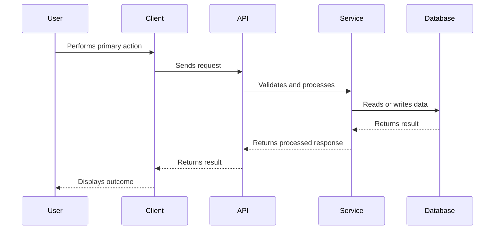
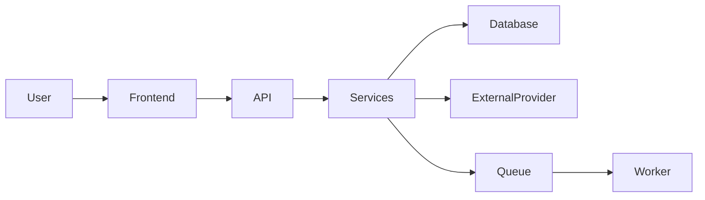

You are acting as a **Senior Software Engineer, Technical Interviewer, and Project Reviewer**.

Your task is to analyze the current code repository and create a comprehensive project-preparation package that helps the project owner explain, defend, and discuss the project in a technical interview.

## **Primary Objective**

Create a folder named:

```
/preparation

```

inside the repository root.

Create exactly these three files inside it:

```
/preparation/overview.md
/preparation/Intro.md
/preparation/Q&A.md

```

The final preparation material should help someone:

- Understand the project deeply.
- Explain it clearly in approximately three minutes.
- Defend architectural and engineering decisions.
- Discuss trade-offs with a senior engineer.
- Identify current limitations honestly.
- Explain how the project could evolve into a production-grade system.

Do not modify application code, configuration, tests, documentation, dependencies, or any other repository files.

You may overwrite existing files inside `/preparation`.

---

# **1. Repository Analysis Instructions**

Before writing the preparation files, inspect the repository carefully.

Analyze all relevant available sources, including:

- Existing README files.
- Project documentation.
- Package manifests and dependency files.
- Application entry points.
- Folder and module structure.
- API routes and controllers.
- Service and business-logic layers.
- Database models, schemas, and migrations.
- Frontend pages and components.
- Authentication and authorization logic.
- Background jobs, queues, schedulers, and workers.
- External service integrations.
- AI models, prompts, agents, RAG pipelines, or tool-calling logic.
- Configuration files.
- Environment variable examples.
- Docker and container configuration.
- Deployment and infrastructure files.
- CI/CD workflows.
- Test files.
- Monitoring, logging, analytics, and error-handling code.
- Seed data, sample data, or fixtures.
- Comments that explain design decisions.
- TODOs, FIXMEs, stubs, and incomplete modules.

Do not base the preparation only on the README. Treat the repository code and configuration as the primary source of truth.

## **Evidence Priority**

Use the following priority order:

1. Working application code.
2. Tests.
3. Configuration and infrastructure files.
4. Database models and migrations.
5. API contracts and schemas.
6. Existing technical documentation.
7. README claims.
8. Reasonable inference.
9. Explicitly labelled hypothetical assumptions.

When the README disagrees with the implementation, prefer the implementation and mention the discrepancy when relevant.

---

# **2. Grounding and Assumption Rules**

The output must be grounded in repository evidence wherever possible.

For every important claim, determine whether it is:

- **Verified:** Directly supported by code, configuration, tests, or documentation.
- **Inferred:** Strongly suggested by the structure or implementation.
- **Assumed:** Not available in the repository but useful for explaining the project.

Do not repeatedly add labels to every sentence. Instead, clearly identify uncertain information in sections such as:

- Assumptions
- Inferred architecture
- Information not available in the repository
- Likely production setup
- Potential future implementation

You may introduce hypothetical assumptions when required, but follow these rules:

- Keep assumptions realistic.
- Do not present assumptions as implemented features.
- Do not invent exact user numbers, revenue, traffic, latency, accuracy, cost, or scale.
- Do not claim the system is deployed unless deployment evidence exists.
- Do not claim tests pass unless you actually verified them.
- Do not claim a technology is used merely because it appears in a dependency file; verify where possible that it is used.
- Do not invent engineering decisions when no evidence exists.
- Clearly state what would need confirmation from the project owner.

Use language such as:

> The repository does not contain production traffic data. For interview discussion, this preparation assumes an early-stage system with moderate traffic.

Do not use language such as:

> The system handles one million requests per day.

unless that fact is explicitly supported by repository evidence.

---

# **3. Analysis Approach**

Build an internal mental model of the project before writing.

At minimum, determine:

## **Product Understanding**

- What problem does the project solve?
- Who are the intended users?
- What is the primary user journey?
- What are the main use cases?
- What value does the project provide?
- What is the apparent maturity level: prototype, MVP, internal tool, portfolio project, or production system?

## **System Understanding**

- What are the major components?
- How does data move through the system?
- What happens during the primary workflow?
- What technologies are used?
- Why might those technologies have been selected?
- Where is business logic located?
- How is state stored?
- How are users authenticated?
- How are permissions enforced?
- What external systems are involved?
- What asynchronous operations exist?
- How are failures handled?
- What are the most important boundaries between modules?

## **Engineering Understanding**

- What important design decisions are visible?
- What trade-offs were likely made?
- What was optimized for?
- What was intentionally kept simple?
- What technical debt is visible?
- What parts are fragile?
- What parts are well designed?
- What would become a bottleneck first?
- What security or reliability risks exist?
- What is missing for production readiness?
- What improvements would give the highest return?

## **Interview Understanding**

- Which decisions would a senior engineer challenge?
- Which parts would require deeper justification?
- Which follow-up questions are likely?
- Which answers can be defended with code evidence?
- Which answers require an honest assumption?
- What mistakes or limitations should the candidate acknowledge proactively?

---

# **4. Output Quality Requirements**

Write the files for a candidate preparing for a technical interview.

The content should be:

- Detailed but readable.
- Technically accurate.
- Direct and specific to this repository.
- Honest about uncertainty.
- Structured with clear Markdown headings.
- Free from generic filler.
- Useful for revision before an interview.
- Written in natural first-person language where the candidate is expected to speak.
- Understandable without opening the codebase every time.

Avoid generic claims such as:

- “The project uses a scalable architecture.”
- “Security is important.”
- “The application follows best practices.”
- “Microservices improve scalability.”
- “Caching makes the application faster.”

Replace them with project-specific explanations.

For example:

> The API layer delegates order processing to the `OrderService`, while persistence is handled through the repository layer. This separation makes the order workflow easier to test, but it also introduces additional abstractions that may be unnecessary at the project’s current scale.

Mention filenames, modules, directories, services, classes, or functions when they provide useful evidence. Do not turn the documents into a line-by-line code walkthrough.

# **5. File One: /preparation/[overview.md](http://overview.md)**

Create a comprehensive technical and product review of the project.

This file should explain everything the candidate should understand about the project except unnecessary line-level implementation details.

Use the following structure. Adapt headings when the repository requires it, but do not omit major sections.

# **Project Overview**

Start with a concise explanation of:

- What the project is.
- What problem it solves.
- Who it is for.
- Its primary value proposition.
- Its apparent current stage.

## **1. Executive Summary**

Provide a strong two-to-four paragraph summary covering:

- The project’s purpose.
- The main workflow.
- The broad architecture.
- The most important engineering decisions.
- The current strengths.
- The most important limitations.

## **2. Problem Statement**

Explain:

- The underlying user or business problem.
- Why the problem matters.
- How users may solve it without this project.
- What friction the project removes.
- What assumptions the project makes about its users.

Do not invent market statistics.

## **3. Target Users and Use Cases**

Identify:

- Primary users.
- Secondary users.
- Admin or operational users, if any.
- Main use cases.
- Less obvious use cases visible from the code.

Separate verified use cases from inferred ones.

## **4. Core User Journey**

Describe the main end-to-end journey step by step.

For every major step, explain:

- What the user does.
- What the frontend or client does.
- Which backend component handles it.
- What data is read or written.
- Which external services are involved.
- What result the user receives.
- What can fail at that step.

Use a Mermaid sequence diagram when it improves understanding.

Example format:



The diagram must reflect the actual repository rather than a generic architecture.

## **5. Feature Breakdown**

For each major feature, explain:

- What it does.
- Why it exists.
- How it fits into the user journey.
- Which components implement it.
- Important constraints.
- Current limitations.

Distinguish between:

- Fully implemented features.
- Partially implemented features.
- Experimental features.
- Planned or stubbed features.

## **6. Technology Stack**

Create a table with these columns:


| **Layer** | **Technology** | **Where It Is Used** | **Why It Fits** | **Trade-Offs** |
| --------- | -------------- | -------------------- | --------------- | -------------- |


Include only technologies that are meaningfully used.

Potential layers include:

- Frontend.
- Backend.
- Database.
- Cache.
- Authentication.
- Queues.
- AI or model layer.
- Search or vector database.
- File storage.
- Testing.
- Deployment.
- Observability.
- CI/CD.

Do not assume the original developer’s exact motivation. Phrase inferred motivations carefully.

## **7. High-Level Architecture**

Explain the major components and their responsibilities.

Include:

- Client or frontend.
- Backend/API.
- Business-logic layer.
- Database and storage.
- External services.
- Background processing.
- AI or agent components.
- Monitoring and deployment components.

Add a Mermaid architecture diagram when possible.

Example:



Replace this with a repository-specific diagram.

## **8. Module and Folder Map**

Provide a practical map of the repository.

Use a table:


| **Path** | **Responsibility** | **Important Notes** |
| -------- | ------------------ | ------------------- |


Include only important paths. Explain how responsibilities are divided and where a new engineer would start reading.

## **9. Data Model**

Explain:

- Important entities.
- Relationships between entities.
- Ownership rules.
- Important state transitions.
- Fields that influence business behavior.
- Data lifecycle.
- Deletion or archival behavior, if visible.

Include a Mermaid entity relationship diagram when the models are sufficiently clear.

Do not list every field unless it is important to understanding the system.

## **10. API and Interface Design**

Summarize:

- Major endpoints, procedures, commands, or interfaces.
- Authentication requirements.
- Input validation.
- Response shape.
- Error-handling conventions.
- Versioning, if any.
- Idempotency, if any.
- Rate limiting, if any.

Avoid reproducing the entire API specification.

## **11. Authentication and Authorization**

Explain:

- How identity is established.
- How sessions or tokens are managed.
- How permissions are checked.
- User roles.
- Protected resources.
- Security limitations.
- Missing production safeguards.

Do not claim the implementation is secure merely because authentication exists.

## **12. Important Engineering Decisions**

Identify the most significant design choices visible in the repository.

For each decision, include:

### **Decision**

What was chosen?

### **Evidence**

Where is this visible in the repository?

### **Likely Reason**

Why was this choice reasonable?

### **Benefit**

What does it simplify or improve?

### **Cost**

What complexity or limitation does it introduce?

### **Alternative**

What other approach could have been used?

### **When to Reconsider**

At what scale or requirement would the current decision stop being appropriate?

Cover approximately five to ten meaningful decisions.

Examples may include:

- Monolith versus services.
- SQL versus NoSQL.
- Synchronous versus asynchronous execution.
- Polling versus WebSockets.
- Framework choice.
- Server-side versus client-side rendering.
- ORM versus direct queries.
- Managed API versus self-hosted model.
- RAG versus fine-tuning.
- Stateless versus stateful agents.
- Local storage versus object storage.
- Custom authentication versus managed authentication.
- Simplicity versus extensibility.

Only include decisions relevant to this project.

## **13. Reliability and Failure Handling**

Explain:

- Likely failure points.
- Validation behavior.
- Retry behavior.
- Timeout handling.
- Partial failure behavior.
- Transaction boundaries.
- Data consistency risks.
- Recovery options.
- User-visible failure states.
- Missing safeguards.

Discuss what happens when external dependencies fail.

## **14. Performance and Scalability**

Explain the current likely performance characteristics.

Cover:

- Expensive workflows.
- Database query risks.
- N+1 query risks.
- Blocking operations.
- Large payloads.
- File-processing bottlenecks.
- Model inference latency.
- Queue bottlenecks.
- Cache opportunities.
- Horizontal scaling constraints.
- Stateful components.
- Concurrency concerns.

Do not invent benchmarks.

State what should be measured before optimization.

## **15. Security and Privacy Review**

Review the project for:

- Authentication weaknesses.
- Authorization gaps.
- Input validation.
- Injection risks.
- Secret management.
- Sensitive data exposure.
- Logging of private information.
- File-upload risks.
- Cross-origin configuration.
- CSRF, XSS, SSRF, or request-forgery risks where relevant.
- Dependency risks.
- Rate limiting.
- Abuse prevention.
- AI prompt injection or data leakage where relevant.

Clearly separate observed issues from general production recommendations.

Do not provide exploit instructions.

## **16. Testing and Quality Strategy**

Explain:

- Existing test types.
- What appears well covered.
- What appears untested.
- How external services are mocked.
- Whether integration tests exist.
- Whether end-to-end tests exist.
- Whether tests appear runnable.
- Important missing test cases.

Recommend a realistic testing pyramid for this project.

Do not state that tests pass unless verified.

## **17. Deployment and Operations**

Explain what the repository reveals about:

- Local development.
- Build process.
- Deployment.
- Environment configuration.
- Containers.
- Infrastructure.
- Database migrations.
- CI/CD.
- Logging.
- Monitoring.
- Alerting.
- Rollback.
- Backups.

If production deployment information is absent, say so clearly.

## **18. Current Strengths**

List the strongest parts of the project.

Each strength must reference something specific, such as:

- Clear module boundaries.
- Thoughtful schema design.
- Good validation.
- Strong tests.
- Practical framework choice.
- Useful observability.
- Graceful error handling.
- Good developer experience.

Avoid praise without evidence.

## **19. Current Limitations and Technical Debt**

Identify the most important limitations.

For each item, explain:

- The limitation.
- Its impact.
- Its urgency.
- A practical improvement.
- Whether it is acceptable at the project’s current stage.

Prioritize the list as:

- Critical.
- High.
- Medium.
- Low.

## **20. Production Readiness Gap**

Explain what would be needed to move the project from its current state to a production-grade system.

Cover relevant areas such as:

- Security.
- Reliability.
- Testing.
- Observability.
- Deployment automation.
- Data migration.
- Backups.
- Scalability.
- Cost controls.
- Compliance.
- Operational tooling.
- Documentation.
- Support workflows.

## **21. Improvement Roadmap**

Create a realistic roadmap divided into:

### **Immediate: Next 1–2 Weeks**

Small, high-impact fixes.

### **Near Term: Next 1–2 Months**

Structural improvements and missing production features.

### **Medium Term: Next 3–6 Months**

Scale, reliability, and product maturity improvements.

For each improvement, include:

- Why it matters.
- Expected impact.
- Approximate complexity: Low, Medium, or High.
- Dependencies.
- How success should be measured.

Do not include arbitrary calendar dates.

## **22. Metrics That Should Be Tracked**

Recommend project-specific metrics in these categories where relevant:

- Product metrics.
- Reliability metrics.
- Performance metrics.
- Cost metrics.
- Security metrics.
- AI quality metrics.
- Operational metrics.

Explain why each metric matters.

Do not invent current metric values.

## **23. Key Project Stories for Interviews**

Identify five to eight strong stories that the candidate could discuss.

Examples:

- A difficult design choice.
- A feature that required coordinating multiple components.
- A failure case that influenced architecture.
- A simplification that reduced complexity.
- A technical debt decision.
- A scalability concern.
- A security improvement.
- An AI-quality or evaluation challenge.

For each story, provide:

- Context.
- Challenge.
- Decision.
- Result or likely result.
- Learning.
- Follow-up improvement.

Do not fabricate personal experiences. When the repository does not reveal the actual history, phrase the story as a discussion framework rather than a historical claim.

## **24. Facts, Inferences, and Assumptions**

End with three subsections:

### **Verified from the Repository**

List the most important confirmed facts.

### **Strongly Inferred**

List conclusions that are likely but not directly documented.

### **Assumptions Requiring Confirmation**

List information the candidate should verify before using it in an interview.

---

# **6. File Two: /preparation/[Intro.md](http://Intro.md)**

Create a concise spoken introduction that can be delivered in approximately three minutes.

The introduction should sound natural in a technical interview and should not feel like a README being read aloud.

Use first-person language.

Structure it around:

# **Three-Minute Project Introduction**

## **Why**

Explain:

- The problem.
- Who faces it.
- Why solving it matters.
- What motivated the project, when that can be determined.

## **What**

Explain:

- What the system does.
- The main user journey.
- The most important features.
- The project’s current scope.

## **How**

Explain:

- The high-level architecture.
- Key technologies.
- One or two important engineering decisions.
- One meaningful technical challenge.
- One important trade-off.

## **What Now**

Explain:

- Current maturity.
- Largest limitation.
- Most valuable next improvement.
- How the project could evolve.

The final script should:

- Be approximately 350–500 words.
- Be understandable to a senior engineer unfamiliar with the project.
- Include enough technical depth to invite useful follow-up questions.
- Avoid unnecessary low-level implementation details.
- Avoid exaggerated claims.
- Clearly distinguish implemented behavior from planned behavior.
- Mention the strongest technical decision.
- Mention one limitation proactively.
- End with a confident transition into deeper discussion.

End with:

## **Thirty-Second Version**

Provide a compressed 75–120 word version for interviews where the candidate is asked:

> Tell me briefly about your project.

Also include:

## **Key Points to Remember**

Provide five to eight short memory cues rather than another full script.

---

# **7. File Three: /preparation/Q&amp;[A.md](http://A.md)**

Create exactly 20 senior-engineer-level interview questions with detailed model answers.

The questions should be specific to this repository and should focus on technical judgment rather than basic definitions.

The set should test:

- Project understanding.
- Architecture.
- Data modelling.
- API design.
- Trade-offs.
- Scalability.
- Performance.
- Reliability.
- Security.
- Testing.
- Deployment.
- Observability.
- Technical debt.
- Product-engineering judgment.
- Future evolution.

When relevant, include AI-specific topics such as:

- Model selection.
- Prompt design.
- RAG architecture.
- Chunking.
- Embeddings.
- Evaluation.
- Hallucinations.
- Tool calling.
- Agent state.
- Guardrails.
- Latency.
- Cost.
- Prompt injection.
- Human approval.
- Deterministic versus probabilistic behavior.

Do not force AI questions if the repository is not an AI project.

## **Question Selection**

The 20 questions should include a balanced mix of:

- Why was this design selected?
- What alternatives were considered?
- What breaks at ten times the current scale?
- How would you make this production-ready?
- How would you debug a specific failure?
- How would you improve security?
- How would you test a difficult workflow?
- What technical debt would you address first?
- What would you redesign today?
- How would requirements change the architecture?
- How would you measure whether the system works well?
- What failure modes have not been handled?
- Which decision are you least confident about?
- What would a senior engineer challenge?
- How should the project evolve over the next six months?

Questions must reference actual project components whenever possible.

Avoid generic questions such as:

> What is REST?

Prefer questions such as:

> The project performs document processing synchronously inside the upload request. Why was that acceptable for the initial version, and what architecture would you use when document size and traffic increase?

## **Required Structure for Every Question**

Use this structure exactly:

## **1. Question**

Write the interview question.

### **What the Interviewer Is Testing**

Explain the engineering competency behind the question.

### **Strong Answer**

Write a detailed first-person answer the candidate could give.

The answer should cover:

- The direct answer.
- Repository evidence.
- Why the current approach was reasonable.
- The trade-off.
- The main limitation.
- A realistic alternative.
- The conditions under which the candidate would change the design.

### **Likely Follow-Up**

Add one or two challenging follow-up questions.

### **Strong Follow-Up Direction**

Explain how the candidate should approach those follow-ups.

### **Red Flags to Avoid**

List weak, misleading, or overconfident claims the candidate should avoid.

Repeat this format until exactly 20 questions are complete.

## **Answering Style**

The model answers should:

- Use first-person language.
- Sound like an engineer explaining their own work.
- Be honest about repository limitations.
- Defend reasonable choices without pretending they were perfect.
- Show awareness of alternatives.
- Demonstrate prioritization.
- Distinguish MVP decisions from production decisions.
- Explain when additional complexity is justified.
- Use project-specific evidence.
- Avoid memorized textbook language.

A strong answer should often follow this pattern:

1. State the decision.
2. Explain the context.
3. Explain why it was reasonable.
4. Acknowledge the trade-off.
5. Describe alternatives.
6. State what would trigger a redesign.
7. Explain how the improvement would be validated.

## **Coverage Requirements**

Across the 20 questions, ensure there is at least one detailed question about each applicable area:

1. Product problem and scope.
2. High-level architecture.
3. Major technology choice.
4. Data model.
5. API or interface design.
6. Authentication and authorization.
7. Reliability and failure handling.
8. Performance.
9. Scalability.
10. Concurrency or consistency.
11. Security.
12. Testing.
13. Deployment.
14. Observability.
15. External-service dependency.
16. Most important trade-off.
17. Technical debt.
18. Redesign with more time.
19. Future roadmap.
20. Measurement of success.

When an area does not apply, replace it with another project-specific senior-level topic.

---

# **8. Cross-File Consistency**

Ensure all three files agree on:

- Project purpose.
- Architecture.
- Technology stack.
- Feature status.
- Important decisions.
- Limitations.
- Future roadmap.
- Assumptions.

Do not claim that a feature is implemented in one file and planned in another.

The three files should serve different purposes:

- [`overview.md`](http://overview.md) is the comprehensive reference.
- [`Intro.md`](http://Intro.md) is the spoken interview introduction.
- `Q&[A.md](http://A.md)` is the senior technical interview preparation guide.

Avoid copying large sections verbatim between files.

---

# **9. Final Verification Checklist**

Before completing the task, verify:

- `/preparation` exists at the repository root.
- [`overview.md`](http://overview.md) exists.
- [`Intro.md`](http://Intro.md) exists.
- `Q&[A.md](http://A.md)` exists.
- `Q&[A.md](http://A.md)` contains exactly 20 numbered questions.
- The three-minute introduction follows Why, What, How, and What Now.
- The overview is based on repository evidence.
- Unsupported claims are labelled as assumptions.
- No exact metrics were invented.
- No implementation status was fabricated.
- Important limitations are discussed honestly.
- Trade-offs include meaningful alternatives.
- The content is specific to this repository.
- The documents are valid Markdown.
- Mermaid blocks use valid syntax.
- No repository files outside `/preparation` were modified.
- No secrets or environment-variable values were copied into the preparation files.
- Sensitive credentials, tokens, private keys, and personal information are not exposed.

---

# **10. Final Console Response**

After creating the files, return only a concise summary in this format:

```
Project preparation generated successfully.

Created:
- preparation/overview.md
- preparation/Intro.md
- preparation/Q&A.md

Repository areas reviewed:
- <brief list>

Important assumptions requiring confirmation:
- <brief list or "None">

```

Do not print the full contents of the generated files in the console response.