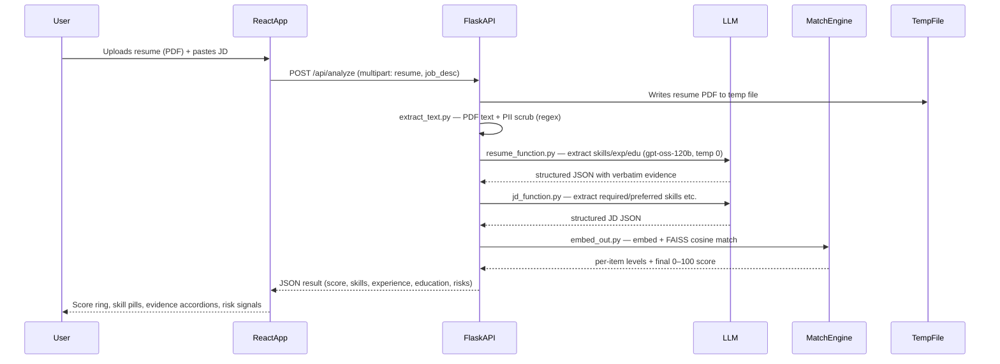
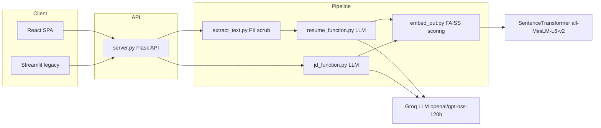
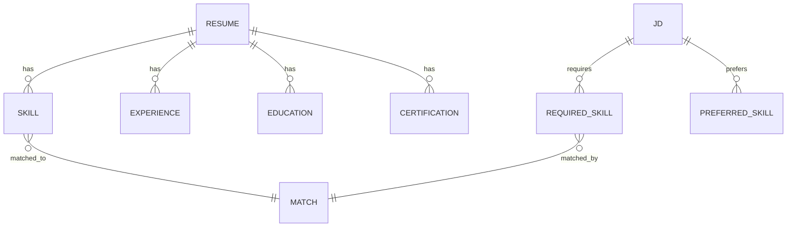

# Glass-Box Recruiter / PRISM — Technical Project Overview

> Companion document to `Intro.md` (spoken introduction) and `Q&A.md` (interview Q&A).
> Everything below is grounded in the repository unless explicitly labelled **inferred** or **assumed**.

---

## 1. Executive Summary

Glass-Box Recruiter (rebranded **PRISM** in the newer web layer) is a resume-screenning tool that scores a candidate's resume against a job description and, crucially, attaches **verbatim evidence** from the resume to every point of its score. The central promise is transparency: instead of a black-box ATS silently rejecting a resume, the recruiter sees *which skill matched, how strongly it was evidenced, what is missing, and which risk signals need manual verification*.

The system is a four-stage, stateless, synchronous pipeline implemented as four Python modules:

1. **Extract** — `extract_text.py` reads the PDF (PyMuPDF/`fitz`) and scrubs PII using regular expressions.
2. **Parse** — `resume_function.py` and `jd_function.py` call a Groq-hosted LLM (`openai/gpt-oss-120b`, temperature 0) through LangChain to convert raw text into structured JSON.
3. **Match** — `embed_out.py` embeds skills with `all-MiniLM-L6-v2`, normalizes vectors to unit length, and matches JD requirements against resume skills using a FAISS `IndexFlatIP` (cosine via inner product).
4. **Score / Render** — a weighted formula (Skills 50% · Experience 30% · Education 20%, minus a 1.5-point-per-item "transparency penalty" capped at 15) yields a 0–100 score, rendered by a React/Vite frontend that calls a Flask API (`server.py`). A Streamlit app (`app.py`) is retained as a legacy fallback UI.

The most important engineering decision is the **evidence-grounding constraint**: the resume-extraction prompt forbids the model from inferring or hallucinating and requires an exact verbatim snippet for every extracted item. That is what makes the output auditable. The most important limitation is the absence of production hardening — no authentication, no rate limiting, no asynchronous or queued processing, no persistent storage, and no tests — which is consistent with a hackathon-stage prototype rather than a production service.

## 2. Problem Statement

Traditional applicant-tracking systems (ATS) are opaque: a resume is commonly rejected with no explanation, and the candidate cannot learn why. The same opacity encourages "keyword stuffing" — candidates optimise for the parser rather than demonstrating real skill — while genuinely strong applicants are filtered out by a brittle keyword match. When LLMs are bolted onto this problem, they often make it *worse* by scoring candidates without transparency, evidence, or privacy.

The project's bet is that a hiring signal is only useful if it is **explainable**: every claim must trace back to a quoted line in the source resume, and the system must actively *penalise* ambiguity rather than reward confident-but-ungrounded answers.

Without this tool, a recruiter's alternatives are: manual resume reading (slow, inconsistent), a conventional keyword ATS (fast but opaque and gameable), or a generic LLM scorer (fast but hallucinatory). The project removes the friction of slow manual screening *and* the trust problem of black-box scoring in one step.

**Assumptions the project makes about its users (from the code):**
- The resume is a **PDF** (the uploader and API both accept only PDF).
- The user is comfortable pasting a full free-text job description.
- The user will accept a *draft* signal and pair it with human review — the README explicitly states it is "not a substitute for human judgment."

## 3. Target Users and Use Cases

**Primary user — recruiter / hiring manager:** pastes a JD, uploads a resume, gets a scored, evidence-backed shortlist signal.

**Secondary user — candidate:** could use the same tool to see how their resume would score against a target role (the evidence cards tell them exactly what to improve). This is *inferred* — the UI is written for a screener, but nothing prevents candidate self-use.

**Operational / admin user:** *none implemented.* There is no accounts, roles, or admin surface.

**Main use case (verified):** resume-vs-JD matching with a 0–100 score, per-skill match levels (advanced/medium/low), experience & education breakdown, and risk signals. See `server.py` `/api/analyze`, `frontend/src/components/Results.jsx`.

**Less obvious use cases visible in code:**
- **Headless CLI demo** (`main.py`) runs the full pipeline on `resume/1.pdf` against a built-in JD and prints JSON — useful for debugging and for showing the engine works without any UI.
- **Programmatic reuse** — `embed_out.run_matching_pipeline(jd_json, resume_json)` is importable and returns the structured match independent of any UI.
- **Built-in demo JD** — `server.py` exposes `/api/demo` and `/api/jd-sample` so the frontend (and a live demo) can run without pasting a JD.

**Inferred vs verified:** the "multi-source evidence" story in the README (cross-referencing GitHub/LinkedIn) is **not implemented** — those two optional URL fields are collected but only used to emit a "not provided" risk signal. Treat any GitHub/LinkedIn cross-verification claim as *not present*.

## 4. Core User Journey

End-to-end flow as implemented by the React frontend + Flask API:



**Step-by-step with failure points:**

1. **Upload + submit.** The frontend (`Analyzer.jsx`) enforces `application/pdf` client-side and a "Max 200 MB" hint. *Failure:* this size limit is **not enforced server-side**; `client.js` just forwards FormData.
2. **PDF → text.** `server.py::_run_analysis` writes the uploaded bytes to a `NamedTemporaryFile`, calls `extract_and_clean`, then deletes the temp file in a `finally`. *Failure:* a malformed/encrypted PDF or a scan-only PDF yields empty or garbage text, which silently degrades the downstream extraction. No page/time limits.
3. **Resume parsing.** `resume_function` sends the scrubbed text to the LLM; a non-JSON or wrapped response is parsed by `_parse_json` (which tolerates ```json fences). *Failure:* invalid JSON surfaces as a 422 `RuntimeError` (server) with the first 300 chars echoed.
4. **JD parsing.** Same LLM path; missing required fields return `null` per the strict prompt. *Failure:* same JSON-failure handling.
5. **Matching + scoring.** `embed_out` embeds and matches; `compute_final_score` applies weights and the miss penalty. *Failure:* if the JD has no skills/experience/education, those categories score `None` and the weight is renormalised over the available categories only.
6. **Render.** React renders the score ring, pills and evidence accordions. *Failure:* any backend exception returns HTTP 500 with a generic message, surfacing as the overlay error in `AnalysisSequence.jsx`.


## 5. Feature Breakdown

| Feature | Status | What it does | Where | Notes / limitations |
| --- | --- | --- | --- | --- |
| PDF text extraction | Implemented | Pulls text from PDF via PyMuPDF and cleans it | `extract_text.py` | No OCR; scanned PDFs produce empty text |
| PII scrubbing | Implemented (basic) | Regex removal of name, phone, email, URL, gender, location | `extract_text.py` | Fragile; see Security section |
| Resume → structured JSON | Implemented | LLM extraction of skills/experience/education/certifications with verbatim evidence | `resume_function.py` | Depends on prompt discipline; no JSON-schema enforcement |
| JD → structured JSON | Implemented | LLM extraction of required/preferred skills, experience level, education eligibility | `jd_function.py` | Same LLM, separate strict prompt |
| Semantic skill matching | Implemented | Embed + FAISS `IndexFlatIP` cosine matching of JD requirements vs resume skills | `embed_out.py` | Brute-force flat index, k=1 nearest neighbour |
| Weighted 0–100 scoring | Implemented | Skills 50 / Exp 30 / Edu 20, minus 1.5pt-per-miss penalty (cap 15) | `embed_out.compute_final_score` | Simple, auditable, but weighting is hand-tuned |
| Evidence-grounded results UI | Implemented | Score ring, skill pills, evidence accordions, risk signals | `frontend/src/components/Results.jsx`; `app.py` (Streamlit legacy) | Two parallel frontends |
| Fit classification label | Implemented | Strong/Moderate/Weak fit badge | `Results.jsx` (≥75/≥50) | Thresholds **differ** from README (≥70/≥45) |
| Optional GitHub/LinkedIn | **Stubbed** | Fields collected; only used to emit a “not provided” risk | `app.py:788-791`, `server.py`, `client.js` | README advertises cross-verification that is **not implemented** |
| Flask REST API | Implemented | `POST /api/analyze`, `GET /api/health`, `/api/demo`, `/api/jd-sample` | `server.py` | No auth/rate-limit/versioning |
| CLI demo | Implemented | Headless run on `resume/1.pdf` vs built-in JD | `main.py` | Dev/debug utility |
| Programmatic engine reuse | Implemented | `run_matching_pipeline(jd_json, resume_json)` importable | `embed_out.py` | Clean boundary for reuse |

## 6. Technology Stack

| Layer | Technology | Where it is used | Why it fits | Trade-offs |
| --- | --- | --- | --- | --- |
| Frontend | React 18 + Vite | `frontend/` (App, Analyzer, Results) | Fast SPA; Vite dev proxy to Flask | Two frontends exist (React + Streamlit), which is a maintenance cost |
| Frontend UX | GSAP + Lenis + Tailwind 4 | `frontend/src/App.jsx` | Polished scroll/animations for a showcase | Heavy client animation; `prefers-reduced-motion` handled only in Results |
| Backend | Flask 3 + Gunicorn | `server.py`, `Dockerfile` | Lightweight, familiar, thin wrapper over the pipeline | Single worker/thread; sync request handling |
| Legacy UI | Streamlit | `app.py` | Fast to build a rich demo UI | Pulls heavy deps; kept as fallback only |
| LLM | `openai/gpt-oss-120b` via Groq, LangChain | `resume_function.py`, `jd_function.py` | Groq hosting = fast/cheap inference; temp 0 for determinism | Third-party dependency + latency; README badge incorrectly says gpt-4o-mini |
| Embeddings | SentenceTransformers `all-MiniLM-L6-v2` | `embed_out.py` | Small, CPU-friendly, good semantic quality | 384-dim; not a retriever-tuned model; loaded once at import |
| Vector search | FAISS `faiss-cpu` (`IndexFlatIP`) | `embed_out.py` | Exact cosine search, no extra service | Brute force O(n); fine at small n, no persistence |
| PDF | PyMuPDF (`fitz`) | `extract_text.py` | Fast text layer extraction | No OCR, no page limits |
| Math | NumPy | `embed_out.py` | Vector normalization | — |
| Config | python-dotenv | all entry points | Keep `GROQ_API_KEY` out of code | Secret still in plain `.env`; no vault |
| Deployment | Docker, Render Blueprint, HF Spaces, Oracle setup.sh | `Dockerfile`, `render.yaml`, `hf-space/`, `deploy/oracle/setup.sh` | Reproducible image; pre-downloads model | Single worker by design; no autoscaling config |

## 7. High-Level Architecture



The pipeline is a **modular monolith with no persistent store**: every request runs extract → parse → match in memory and returns JSON. `server.py` deliberately does not import `app.py` (to avoid pulling Streamlit) and instead replicates a small `_transform_result` glue so the API JSON shape matches what `app.py` renders — the back-end modules are imported read-only and shared by both frontends.

## 8. Module and Folder Map

| Path | Responsibility | Notes |
| --- | --- | --- |
| `extract_text.py` | PDF text + PII scrubbing | Entry point for the pipeline; regex-based |
| `resume_function.py` | Resume → structured JSON (LLM) | Contains the evidence-grounding system prompt |
| `jd_function.py` | JD → structured JSON (LLM) | Strict fields-or-null prompt |
| `embed_out.py` | Embedding + FAISS matching + scoring | Pure functions; most reusable piece |
| `server.py` | Flask API (prod web service) | Lazy backend import; CORS; temp-file handling |
| `app.py` | Streamlit UI (legacy fallback) | Large (≈40 KB); self-contained UI + glue |
| `main.py` | Headless CLI demo | Runs pipeline on `resume/1.pdf` |
| `frontend/` | React + Vite SPA | The current primary UI |
| `frontend/src/api/client.js` | API client w/ staged progress | Fake progress timer; real fetch to `/api/analyze` |
| `frontend/src/components/Analyzer.jsx` | Upload + JD form | Client-side PDF check only |
| `frontend/src/components/Results.jsx` | Score ring, pills, evidence accordions | Fit thresholds ≥75/≥50 |
| `hf-space/` | Duplicate pipeline subset for HF Spaces | Deploys the API with a smaller image |
| `deploy/oracle/setup.sh` | One-shot Oracle VM provisioning (systemd + ufw) | Assumes files pre-copied to `/opt/prism` |
| `Dockerfile` / `render.yaml` | Container + Render Blueprint | Pre-downloads embedding model at build time |
| `resume/` | Sample PDFs (`1.pdf`, `2.pdf`) | CLI test fixtures; may contain real PII |
| `requirements*.txt` | Python deps (full vs server-only) | `requirements-server.txt` omits Streamlit |

**Where a new engineer should start:** `server.py` → `_run_analysis` (the glue), then `embed_out.py` (the matching/scoring core), then the two extraction prompts in `resume_function.py` / `jd_function.py`.

## 9. Data Model

There is **no database** — the “model” is the shape of the JSON exchanged between the LLM extractors and the matcher. Understanding that schema is understanding the system.

**Entities produced by extraction (resume side, `resume_function.py`):**
- `skills[]` — { name, evidence }
- `experience[]` — { role, organization, duration_years, evidence }
- `education[]` — { degree, field, institution, evidence }
- `certifications[]` — { name, issuer, year, evidence }

**Entities produced by extraction (JD side, `jd_function.py`):**
- `required_skills[]`, `preferred_skills[]`, `experience_level`, `education_eligibility`

**Matching output (`embed_out.py`):**
- `skills[]` — { skill, matched_with, level (advanced/medium/low), score, evidence }
- `experience[]` / `education[]` — { requirement, matched_with, level, score, evidence }
- `final_score` (0–100)



**State transitions:** there are none — every request is independent and stateless. The only “transition” is within a request: raw text → scrubbed text → structured JSON → matched JSON → rendered result. Extracted items always carry an `evidence` string; a missing field is `null`, an empty section is `[]`.

**Data lifecycle:** temp PDFs are created in `/tmp` (`server.py` writes a `NamedTemporaryFile`) and deleted in a `finally` block after extraction. Nothing else is written to disk. There is no retention, archival, or deletion policy because nothing persists.

## 10. API and Interface Design

All routes are in `server.py`:

| Method + path | Purpose | Auth | Notes |
| --- | --- | --- | --- |
| `POST /api/analyze` | Score resume (PDF) vs JD | none | `multipart/form-data`: `resume` (PDF), `job_desc`, optional `github_url`, `linkedin_url` |
| `GET /api/health` | Liveness + dependency check | none | Returns `{ok, service, deps}`; reports `pipeline: ready` or `missing-deps` |
| `GET /api/demo` | Built-in demo JD | none | Dev convenience |
| `GET /api/jd-sample` | Sample JD object | none | Dev convenience |
| `GET /` + `/<path>` | Serve `frontend/dist` | none | Path-traversal guard present |

- **Validation:** presence of `resume` + `.pdf` suffix, and non-empty `job_desc`; a missing `GROQ_API_KEY` raises 422; invalid LLM JSON raises 422; backend missing deps → 503. Server does **not** limit file size or page count.
- **Response shape:** `{ "ok": true, "result": {...} }` on success; `{ "ok": false, "error": "..." }` with 400/422/500/503 on failure.
- **Error conventions:** traceback printed server-side on unexpected errors, generic message returned to client.
- **No versioning, no idempotency keys, no rate limiting.**

## 11. Authentication and Authorization

**There is none.** The API is intended to be exposed behind the Groq key only; the only “identity” in the system is the `GROQ_API_KEY` loaded from the environment by `jd_function` / `resume_function` (after PII scrubbing). No user accounts, sessions, tokens, roles, or per-resource permissions exist anywhere in the codebase.

**Security limitations (observed, not hypothetical):**
- `add_cors_headers` reflects the request `Origin` and falls back to `*`, with `Access-Control-Allow-Credentials: true` — effectively an open CORS policy, not a real access-control boundary.
- Any caller who can reach `/api/analyze` can invoke the LLM at the operator's expense (burning Groq quota), since there is no auth or rate limit.

**Missing production safeguards:** API keys/tokens, rate limiting, request quotas, per-tenant isolation, audit logging, abuse detection. Do **not** claim the implementation is secure because PII is scrubbed; scrubbing is a privacy control, not an auth control.

## 12. Important Engineering Decisions

### Decision 1: Semantic (embedding) matching instead of keyword matching
**Evidence:** `embed_out.py` builds a FAISS `IndexFlatIP` over `all-MiniLM-L6-v2` embeddings and matches by cosine similarity; level thresholds 0.75/0.5 in `get_level`.
**Likely reason:** keyword matching fails on synonyms (“K8s” vs “Kubernetes”), which the project explicitly calls out as a failing of traditional ATS.
**Benefit:** robust to phrasing differences; produces a graded confidence level.
**Cost:** embeddings can collapse distinct skills into a single nearest neighbour (k=1); similarity thresholds are hand-tuned and not calibrated against labelled data.
**Alternative:** exact/keyword or fuzzy matching, or a taxonomy of canonical skills.
**When to reconsider:** once false matches are measured; a threshold sweep or a labelled eval set would justify tuning.

### Decision 2: LLM extraction with strict evidence grounding vs NER/classical parsing
**Evidence:** the resume system prompt (`resume_function.py`) forbids hallucination and requires verbatim `evidence` per item; `temperature=0`.
**Likely reason:** an explainable score is the product's whole point, and only a grounded LLM can produce quoted justification cheaply.
**Benefit:** every output line is auditable back to the source.
**Cost:** no schema validation layer guarantees the JSON shape; a single bad parse (422) fails the whole request. Still probabilistic at heart.
**Alternative:** dedicated NER models / rule-based parsing for skills and dates; JSON-schema / function-calling enforcement.
**When to reconsider:** at higher volume, where cost/latency and parse-failure rate dominate — add schema validation and a retry/fallback path.

### Decision 3: Synchronous, in-request processing (no queue)
**Evidence:** `/api/analyze` runs the entire pipeline in the request thread; `Dockerfile` pins `--workers 1 --threads 1 --timeout 300`.
**Likely reason:** simplest MVP path; one request at a time avoids many copies of the embedding model in RAM.
**Benefit:** simple to reason about; no infra for queues.
**Cost:** a slow LLM call blocks the only worker; concurrent users queue behind a 300s timeout.
**Alternative:** background job + polling/WebSocket, or a task queue (Celery/RQ).
**When to reconsider:** as soon as concurrent traffic exceeds one request in flight.

### Decision 4: No database / stateless service
**Evidence:** no ORM, models, or migrations anywhere; results are returned and discarded.
**Likely reason:** the unit of value is a one-shot score, and persistence adds privacy/compliance burden.
**Benefit:** minimal attack surface, no data retention, trivial deployment.
**Cost:** no history, no comparison over time, no caching, no audit trail.
**Alternative:** store scored matches (with consent) for a recruiter dashboard.
**When to reconsider:** when recruiters need a history/dashboard or when identical resumes are being re-scored at cost.

### Decision 5: PII scrubbing via regex before any LLM call
**Evidence:** `extract_text.py` strips name/phone/email/URL/gender/location with regex before `resume_function` is called.
**Likely reason:** the README frames privacy as a core principle; scrubbing before the third-party LLM keeps PII off external infra.
**Benefit:** cheap, local, no extra service; directionally correct privacy posture.
**Cost:** regex PII detection is brittle (misses non-standard formats, may also strip legitimate content); no redaction audit or verification.
**Alternative:** a proper NER/redaction model, or allow-listing only non-PII sections.
**When to reconsider:** once resumes with complex layouts/formats appear; measure leakage on a labelled PII set.

### Decision 6: Single worker + single thread in production
**Evidence:** gunicorn flags in `Dockerfile`, `hf-space/Dockerfile`, and `deploy/oracle/setup.sh`.
**Likely reason:** embedding model + PyTorch are memory-heavy; the comment explicitly says it avoids every worker loading its own copy.
**Benefit:** predictable memory footprint on cheap VMs / free tiers.
**Cost:** zero concurrency; latency is fully serialised.
**Alternative:** share the model via a dedicated embedding service, or batch embeddings asynchronously.
**When to reconsider:** at >1 concurrent request.

### Decision 7: Two frontends (React for prod, Streamlit as fallback)
**Evidence:** `requirements.txt` lists Streamlit as “legacy fallback”; `server.py` serves `frontend/dist`; `app.py` is a full parallel UI.
**Likely reason:** Streamlit was the fast hackathon UI; React + Vite came later for a more polished public site.
**Benefit:** keeps the demo quick to run; react site looks production-grade.
**Cost:** the `transform_result` glue is duplicated in `app.py` and `server.py` — a place for drift (already visible: different fit thresholds).
**Alternative:** single UI source of truth.
**When to reconsider:** immediately — consolidate on the React frontend and retire Streamlit to reduce drift.

### Decision 8: Managed LLM API (Groq) over self-hosted models
**Evidence:** `ChatGroq(model="openai/gpt-oss-120b")` with a single `GROQ_API_KEY`.
**Likely reason:** zero model-serving infra; free/low-cost tier; fast tokens, ideal for a hackathon.
**Benefit:** no GPU ops burden.
**Cost:** external dependency, per-call cost, data crossing third-party boundary (mitigated by PII scrub), no control over model version.
**Alternative:** self-host an open-weight model, or use a managed orchestrator with fallbacks.
**When to reconsider:** if privacy requirements disallow third-party processing or if cost/latency become dominant.

## 13. Reliability and Failure Handling

**Failure points and current behaviour:**
- **Missing `GROQ_API_KEY`** → `RuntimeError` → HTTP 422 (server) or `ValueError` (app.py).
- **Non-PDF upload** → 400 (“must be a PDF”). Note this checks only the filename extension.
- **Invalid LLM JSON** → `json.JSONDecodeError` caught → 422 with the first 300 chars of the raw response echoed.
- **Backend deps missing** → lazy `_load_backend()` raises `ImportError` → 503, and `/api/health` reports `missing-deps`.
- **Unexpected exception** → `traceback.print_exc()` server-side, generic 500 to the client.
- **Temp file handling** → written to a `NamedTemporaryFile`, deleted in `finally` after extraction; good cleanup discipline.

**What is missing / fragile:**
- **No retries** on LLM or embedding calls — a transient Groq failure becomes a user-visible failure.
- **No timeout at the HTTP client level** (the model call itself has no per-call timeout; gunicorn has a 300s overall timeout).
- **No partial-failure handling:** if the resume parses but the JD fails, the whole request fails (no caching of the expensive resume parse).
- **No transaction boundaries** (there is no persistence, so this is moot today, but will matter once storage is added).
- **LLM output is not schema-validated:** `_parse_json` only tolerates code fences, it does not assert required keys/types — a valid-but-wrong JSON shape propagates into the matcher and may produce a misleading score.
- **User-visible failure states** are limited to a generic error string in the overlay (`AnalysisSequence.jsx` / `Analyzer.jsx`).

**External-dependency failure:** if Groq is down or rate-limited, the system is fully down (single hard dependency). The embedding model is downloaded at build time (Docker) so it is not a runtime external dependency except on first local run.

## 14. Performance and Scalability

**Current likely characteristics (inferred, not benchmarked):**
- Each request makes **two LLM calls** (resume + JD) plus **one embedding pass** (embed the resume skills/exp/edu and the JD skills; `embed_out` rebuilds FAISS indexes per request).
- The embedding model (`all-MiniLM-L6-v2`) is **loaded once at import time** (`embed_out.py` module-level), so it is warm across requests in the same process — but with a single worker there is only one in-flight request.
- The **frontend progress bar is a fake timer** (`client.js` interpolates stage percentages on a 220ms interval, capped at 95 until the fetch resolves) — so perceived latency and real latency are decoupled.

**Risks and bottlenecks:**
- **Concurrency** is the hard limit: `--workers 1 --threads 1` means requests fully serialise; a 10–30s analysis blocks everyone else.
- **N+1-style re-embedding:** for each JD skill, `search_faiss` re-runs `model.encode([query])` once (queries are the JD skills) — acceptable, but the resume index is rebuilt per request from scratch (no caching).
- **Large PDFs:** PyMuPDF reads the whole document with no page cap; a 200-page or image-heavy PDF increases extraction time/memory. The client hint (“Max 200 MB”) is not enforced server-side.
- **Blocking operations:** model.encode and both LLM calls are blocking; the sync worker cannot overlap work.
- **Memory:** PyTorch + the embedding model dominate RAM — the reason the deploy configs pin a single worker.

**What should be measured before optimising:** end-to-end p95 latency, per-stage timing (extract vs parse vs match), Groq call latency, and concurrency behaviour. With those numbers, the first wins are usually: async offload of the two LLM calls, request-level caching of parsed resumes (keyed by content hash), and a real (not fake) progress signal.

## 15. Security and Privacy Review

**Observed issues (verified in code):**
- **No authentication or rate limiting on the API** — anyone who can reach `/api/analyze` consumes Groq credits. High severity for a public deployment.
- **Open CORS** — `Access-Control-Allow-Origin` reflects the request `Origin` and defaults to `*`, with credentials enabled. Effectively no cross-origin control.
- **Upload size not enforced** server-side (client hint only); large/malicious PDFs can tie up the single worker (CPU/memory DoS).
- **File type validated by extension only** — a renamed non-PDF file reaches PyMuPDF.
- **PII scrubbing is regex-only and lossy** — it cannot guarantee no PII leaks to Groq, and it may also remove legitimate text (e.g., a company name or city). This is a privacy control, not a security boundary.
- **No dependency pinning** — `requirements*.txt` use loose/unpinned versions for most packages, so builds are not reproducible and supply-chain risk is unmanaged.
- **Prompt injection surface** — the resume *text* and the *job description* are both user-controlled and fed to the LLM; a crafted resume could inject instructions that distort extraction/scores (relevant because the hiring fairness claims depend on the model obeying its prompt).
- **Path traversal** is guarded in `static_files` (normalise + prefix check) — a positive.
- **Secrets:** `GROQ_API_KEY` is correctly excluded from git and injected via env; but it lives in plaintext `.env` locally and is not cycled/audited.

**General recommendations (not yet present, for production):** authn/authz, rate limiting and quotas, server-side file-size + content-type validation, schema validation + output guardrails, a redaction audit step, pinned dependencies + lockfile, logging without PII, and monitoring/alerting.

## 16. Testing and Quality Strategy

**Verified: there are no test files anywhere in the repository.** No `tests/` directory, no `test_*.py`, no frontend test runner configured.

**What appears well covered by design:** the matcher is composed of small pure functions (`build_faiss_index`, `match_skills`, `compute_category_score`, `compute_final_score`) that would be straightforward to unit-test with fixed JSON fixtures.

**What is untested:** everything — extraction prompts, PII regexes, JSON parsing tolerance, scoring weights/penalty, API validation/error paths, CORS, and the React components.

**How external services are mocked:** not at all (no test infrastructure).

**Are tests runnable?** There is no test command in `package.json` (only dev/build/preview) and no pytest configuration. A realistic IT claim would be “I would add tests,” not “tests pass.”

**Recommended testing pyramid for this project:**
1. **Unit** (most value, cheapest): scoring math (`compute_final_score` edge cases — empty categories, penalty cap at 15), level thresholds (0.75/0.5 boundaries), FAISS matching with fixed embeddings, PII regex cases, `_parse_json` fence-stripping.
2. **Contract/golden** (high value): freeze a few resume/JD fixtures and assert the full `run_matching_pipeline` output matches an expected shape; protect the JSON contract between LLM and matcher.
3. **Integration** (medium): end-to-end `server.py` with a stubbed/mocked LLM layer (monkeypatch `extract_resume_data`/`extract_jd_data`) to test the Flask endpoint without hitting Groq.
4. **E2E** (low, optional): a Playwright/Cypress pass over the Analyzer → Results flow with a mocked API.

## 17. Deployment and Operations

**What the repo reveals:**
- **Local dev:** `streamlit run app.py`, `python main.py` (CLI), `python server.py` (API on :5000), and `npm run dev` for the frontend (Vite proxies `/api` to :5000).
- **Build:** `Dockerfile` installs `requirements-server.txt`, **pre-downloads** the embedding model at build time (so first request and Render's health check do not block), copies the repo, and runs gunicorn with `--timeout 300 --workers 1 --threads 1`.
- **Deploy targets:** Render (`render.yaml` Blueprint, health check `/api/health`, `GROQ_API_KEY` mounted as a secret), Hugging Face Spaces (`hf-space/` duplicates the pipeline subset with `app_port 7860`), and Oracle Cloud (`deploy/oracle/setup.sh` provisions a systemd `prism.service` + ufw).
- **Config:** `.env.example` documents `GROQ_API_KEY` and optional `PORT`.
- **Migrations:** none (no database).
- **CI/CD:** **none** — no workflow files, no linting, no automated build.

**Missing for production:**
- **Logging** — no structured logs or request IDs; only `print` and `traceback.print_exc()`.
- **Monitoring/alerting** — `/api/health` is the only probe; no metrics, no error alerting.
- **Rollback/backups** — not applicable to a stateless service, but there is no release strategy either.
- **Secrets management** — plain env var; no rotation or vault.
- **Environment parity** — three deploy targets drift (root vs `hf-space/` copies of the pipeline).

## 18. Current Strengths

- **Clear pipeline boundaries.** Each stage is a separate module (`extract_text`, `resume_function`, `jd_function`, `embed_out`) with a single responsibility — new stages are easy to isolate and reason about.
- **Reusable, UI-agnostic engine.** `embed_out.run_matching_pipeline(jd_json, resume_json)` is cleanly importable and shared by `app.py`, `server.py`, and `main.py` — the matching logic is not entangled with any rendering layer.
- **Evidence grounding by design.** The resume prompt (`resume_function.py`) enforces verbatim evidence and a strict “null if absent” rule — the product's core claim is actually codified, not just described in the README.
- **Deterministic LLM config.** `temperature=0` on both extraction calls reduces run-to-run variance, which matters for a scoring product whose fairness is the selling point.
- **Good temp-file hygiene.** The uploaded PDF is written to a temp file and removed in a `finally` (`server.py`), and the static-file route guards against path traversal.
- **Thoughtful deployment hygiene.** The Dockerfiles pre-download the embedding model and deliberately exclude Streamlit from the server image; `requirements-server.txt` documents *why*.
- **A real API with graceful dependency degradation.** Lazy backend imports let `server.py` start and report `/api/health → missing-deps` even when heavy deps are absent.
- **Meaningful error codes.** 400/422/503/500 are used distinctly rather than a blanket 500.

## 19. Current Limitations and Technical Debt

**Critical**
- **No authentication / rate limiting** — public exposure means third parties can spend Groq credits. Impact: direct cost + abuse. Fix: minimal API key + per-key quota.
- **Single `warnings`/readme drift** — fit thresholds, model name, and the “multi-source evidence” claim in the README disagree with the code. Impact: misleading expectation; low cost to fix the docs.

**High**
- **Synchronous single-worker pipeline** — no concurrency; long requests serialise. Fix: async offload + model sharing, or ≥2 workers once memory is profiled.
- **No schema validation of LLM output** — a wrong-shaped JSON silently corrupts scores. Fix: validate required keys/types after `_parse_json`; add a retry.
- **GitHub/LinkedIn stub** — collected but unused, yet advertised. Fix: either implement the cross-check or delete the fields.
- **Duplicated `transform_result` glue** in `app.py` and `server.py` — drift risk. Fix: extract a shared response builder.
- **No tests at all** — any refactor is unguarded. Fix: start with the scoring functions.

**Medium**
- **Regex PII scrubbing** is brittle and unverifiable. Fix: named-entity redaction + a leakage test set.
- **No caching** of parsed resumes; identical files are re-LLM'd. Fix: content-hash cache.
- **Loose dependency versions** — non-reproducible builds. Fix: pin + lockfile.
- **Three deploy targets drift** (`hf-space/` copies the pipeline). Fix: consolidate or generate them.

**Low**
- **Fake frontend progress** — cosmetic, decoupled from real work. Fix: stream real stage events.
- **Legacy Streamlit UI** — maintenance tax. Fix: retire once React is the source of truth.

## 20. Production Readiness Gap

To reach production-grade, the following are missing or insufficient:

- **Security:** authn/authz, rate limiting/quotas, server-side upload limits, content-type validation, dependency pinning, secret rotation, open-CORS review.
- **Reliability:** retries with backoff on LLM calls, per-call timeouts, circuit breakers, schema validation + fallback on bad JSON, structured error taxonomy.
- **Testing:** unit + contract + integration suites and CI to run them.
- **Observability:** structured logging with request IDs, latency/error metrics (p50/p95), error-rate alerting, trace of per-stage timing.
- **Deployment automation:** CI/CD pipeline, environment parity, single deployable unit, rollback story.
- **Data:** a retention policy and consent handling once any persistence is introduced; currently none exists.
- **Scalability:** decouple the embedding model from the request worker; add async/queue; request caching.
- **Cost controls:** Groq spend caps, per-request token budgets, caching to avoid re-processing.
- **Compliance:** hiring/AI fairness and bias documentation; audit trail of scoring decisions; GDPR-style handling for resume PII.
- **Operational tooling / support:** on-call runbooks, status page, escalation.

## 21. Improvement Roadmap

### Immediate (1–2 weeks)
| Change | Why | Impact | Complexity |
| --- | --- | --- | --- |
| Add API key auth + rate limit | Stop unbounded Groq spend | Critical cost/security | Low |
| Pin dependencies (+ lockfile) | Reproducible, safer builds | Reliability/security | Low |
| Validate LLM JSON schema; add 1 retry | Prevent silent bad scores | Correctness | Low |
| Unit-test scoring + PII + `_parse_json` | Guard the core logic | Quality | Low |
| Fix README drift (thresholds/model/evidence claim) | Honest docs | Trust | Low |

### Near term (1–2 months)
| Change | Why | Impact | Complexity |
| --- | --- | --- | --- |
| Async processing (queue + worker) or ≥2 gunicorn workers | Concurrency | Scalability | Medium |
| Content-hash caching of parsed resumes | Cost + latency | Performance/cost | Medium |
| Extract shared `transform_result`; retire Streamlit | Remove drift | Maintainability | Medium |
| Named-entity PII redaction + leakage tests | Privacy correctness | Compliance | Medium |
| Structured logging + latency metrics | Debuggability | Observability | Medium |
| CI (lint + tests on PR) | Guard future change | Quality | Medium |

### Medium term (3–6 months)
| Change | Why | Impact | Complexity |
| --- | --- | --- | --- |
| Recruiter dashboard + persistence (opt-in) | Product maturity | Product | High |
| Labelled eval set + threshold calibration | Score quality | Correctness/fairness | High |
| Bias/fairness evaluation across demographics | Responsible AI | Compliance/trust | High |
| Real streaming progress + better error UX | Honesty + polish | UX | Medium |
| Embedding-svc separation / autoscaling | Cost at scale | Scalability | High |

> No calendar dates are promised — this is a relative ordering.

## 22. Metrics That Should Be Tracked

| Category | Metric | Why it matters |
| --- | --- | --- |
| Product | # analyses per day; % rescored | Adoption + repeat use |
| Reliability | error rate by endpoint; LLM parse-failure rate | Core quality |
| Performance | p50/p95 end-to-end + per-stage latency | User experience + bottleneck ID |
| Cost | Groq tokens/credits per analysis; cache hit rate | COGS control |
| Security | auth/rate-limit rejections; abuse attempts | Exposure |
| AI quality | % fields with valid schema; score stability across runs; false-positive/negative rate vs manual review; hallucination/ungrounded-evidence rate | Trust in the verdict |
| Fairness | score distribution across demographic slices (where lawful) | Bias control |
| Operational | build/deploy success; `/api/health` uptime | Run the service |

> None of these values are known today — they must be instrumented before any are quoted.

## 23. Key Project Stories for Interviews

These are **discussion frameworks**, not claims of past events (the repository does not record its history):

1. **Grounding over cleverness** — deciding to force verbatim evidence from the LLM, and the trade-off: a more constrained model that sometimes returns null rather than a confident wrong answer.
2. **Semantic vs keyword matching** — why embeddings beat regex for skill synonyms, and where the k=1 nearest-neighbour approach can still fool you.
3. **Privacy-first scrubbing** — the choice to strip PII before any third-party LLM call, and its known limits (regex brittleness).
4. **One worker on purpose** — pinning gunicorn to a single worker because the embedding model is memory-heavy, and when that stops being acceptable.
5. **Two frontends, one pipeline** — Streamlit for speed, React for polish, and the duplicated glue that resulted; the lesson about single sources of truth.
6. **The stub that advertised too much** — GitHub/LinkedIn “multi-source evidence” in the README vs the reality that the fields are unused; a story about doc honesty.
7. **Scoring transparency** — the 1.5-point miss penalty (capped at 15) as a product decision to punish ambiguity.
8. **Faking progress honestly** — the frontend progress bar as a UX placeholder, and why real streaming is the correct next step.

## 24. Facts, Inferences, and Assumptions

### Verified from the Repository
- Four-stage pipeline: `extract_text.py` → `resume_function.py`/`jd_function.py` (Groq `openai/gpt-oss-120b`, temp 0) → `embed_out.py` (FAISS + `all-MiniLM-L6-v2`) → weighted score (50/30/20, 1.5pt penalty cap 15).
- Flask API routes: `/api/analyze`, `/api/health`, `/api/demo`, `/api/jd-sample`; React + Vite frontend; Streamlit `app.py` fallback; CLI `main.py`.
- No authentication, no rate limiting, no database, no tests, no CI.
- PII scrubbed via regex before LLM calls; GitHub/LinkedIn collected but only used for a “not provided” risk signal.
- Deploy targets: Docker/Render/HF Spaces/Oracle via gunicorn `--workers 1 --threads 1 --timeout 300`.

### Strongly Inferred
- Built as a hackathon prototype (TechKriti 2025) and iterated toward a public demo — the React site, multiple deploy targets, and the “legacy Streamlit” comment all point to this.
- The single-worker choice is driven by embedding-model memory footprint (stated in code comments).
- GitHub/LinkedIn were planned for a cross-verification feature that was never finished.

### Assumptions Requiring Confirmation
- That the project has **not** been deployed to a public domain (no deployment evidence in repo) — confirm with the owner.
- Any traffic, latency, accuracy, or cost figures — **none are recorded**; confirm before repeating.
- The exact motivation behind technology choices (Groq, MiniLM) is inferred from code comments and README; confirm the author's rationale.
- Whether sample resumes in `resume/` contain real PII (they appear to) — confirm and scrub before any real use.
